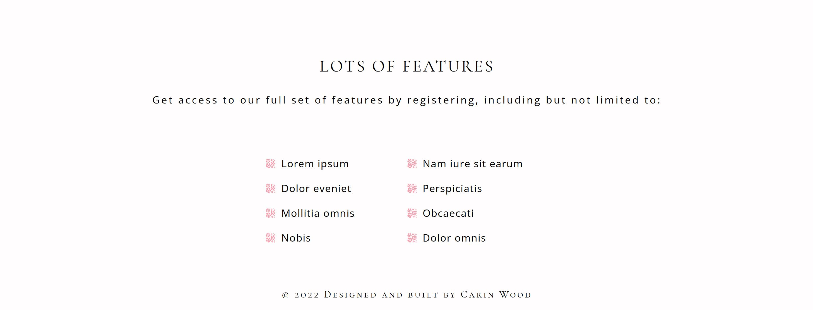

# Log in page





This is a [Next.js](https://nextjs.org/) project bootstrapped with [`create-next-app`](https://github.com/vercel/next.js/tree/canary/packages/create-next-app).

<details>
<summary>Getting Started</summary>
First, run the development server:

```bash
npm run dev
# or
yarn dev
```

Open [http://localhost:3000](http://localhost:3000) with your browser to see the result.

You can start editing the page by modifying `pages/index.js`. The page auto-updates as you edit the file.

[API routes](https://nextjs.org/docs/api-routes/introduction) can be accessed on [http://localhost:3000/api/hello](http://localhost:3000/api/hello). This endpoint can be edited in `pages/api/hello.js`.

The `pages/api` directory is mapped to `/api/*`. Files in this directory are treated as [API routes](https://nextjs.org/docs/api-routes/introduction) instead of React pages.

## Learn More

To learn more about Next.js, take a look at the following resources:

- [Next.js Documentation](https://nextjs.org/docs) - learn about Next.js features and API.
- [Learn Next.js](https://nextjs.org/learn) - an interactive Next.js tutorial.

You can check out [the Next.js GitHub repository](https://github.com/vercel/next.js/) - your feedback and contributions are welcome!

## Deploy on Vercel

The easiest way to deploy your Next.js app is to use the [Vercel Platform](https://vercel.com/new?utm_medium=default-template&filter=next.js&utm_source=create-next-app&utm_campaign=create-next-app-readme) from the creators of Next.js.

Check out our [Next.js deployment documentation](https://nextjs.org/docs/deployment) for more details.
</details>

```shell
Installera följande:

npm install react-icons --save
npm install react-spinners

```

# Dokumentation

## Design

Jag har gjort en väldigt enkel och minimalistisk design. Det ska vara lätt för användaren att snabbt förstå vad som händer på sidan. Rubrikerna är i en annan font än texten för att ögat snabbt ska dras till dem. Färgsättningen är lugn och harmonisk då den har rosa och vit bakgrund med svart text.

## Avgränsning

Jag har valt att använda mig av JavaScript och JavaScriptbiblioteket Next.js. Detta för att jag anser att uppgiften skulle ta för mycket tid om jag hade behövt sätta mig in i programmeringssprket Elm som är helt nytt för mig.

Next.js är ett smidigt bibliotek att använda då den bland annat har mycket enkla features för navigering mellan sidor och smidig länkning till sidor.

Jag har använt mig av CSS modules för att det ska bli enklare att styla projektet då klassnamnen inte krockar med varandra.

## Logik

##### Nedan följer några kodexempel från min kod för att visa vilken logik jag har använt mig av

### If-satser

För att lösa logiken med att det måste stå samma sak i fältet för password respektive fältet för confirm password har jag använt mig av en if-sats. Jag har gjort en strikt jämförelse av värdet för password och värdet för confirmPassword. Om värdena är exakt lika så kommer en loading spinner och popupruta som gratulerar användaren för att den är registrerad att komma fram. Om värdena inte är lika körs else-satsen och en alert ruta kommer fram som säger 'Password and Confirm password fields must match!'.

```javascript

           if(password === confirmPassword) {
        setLoading(true)
        setTimeout(() =>{
          setLoading(false)
          setShowPopup(true)
         }, 2000)
        
      
       } else {
        alert('Password and Confirm password fields must match!')
       }  

```

### Visa / visa inte lösenord

Den här funktionen gjordes med en state, där en boolean initialt har vädet false. Då man klickar på det stängda ögat anropas en funktion som sätter värdet true istället. Om värdet redan har togglats en gång och är true blir värdet istället false.

För att visa respektive inte visa lösenordet gjorde jag sen en ternary operator för värdet av "type" i inputen för lösenordet. Om ovan nämda state (som jag kallar för showPassword) har sitt ursprungsvärde false ska type sättas till "password", om den istället är true ska värdet sättas till "text". Nedan kod visar hur denna ternary ser ut:

```javascript

           <input 
              type={showPassword ? "text" : "password"} 
              id="password" 
              className={styles.input} 
              placeholder="Password*"
              value={password}
              onChange={(e) => setPassword(e.target.value)}
            />

```

Samma princip användes för att toggla ikonen för öppet respektive stängt öga:

```javascript

            <span 
            className={styles.eyespan} 
            onClick={() => toggleShowPassword()}
            >
            {showPassword ? <FaRegEye className={styles.eye}/>:<FaRegEyeSlash className={styles.eye}/>}
            </span>

```

### Short circuit

Istället för att använda sig av en ternary operator kan man vid vissa tillfällen ha mer nytta av att använda en så kallad short circuit. Den används med fördel då man vill rendera någonting när en boolean är sann, men inte visa någonting alls då vädet på boolean är falskt.

I nedan exempel vill jag rendera en popupruta som säger att användaren är registrerad då alla värden är korrekt ifyllda i inputfälten. Om registreringen inte går igenom vill jag inte rendera någonting. I detta fallet kan man använda sig av && för att rendera någonting så fort en boolean är sann.

```javascript
   
      {showPopup && <Popup 
    firstName={firstName} 
    showPopupFunc={showPopupFunc}
    setFirstName={setFirstName}
    setLastName={setLastName}
    setPassword={setPassword}
    setEmail={setEmail}
    setConfirmPassword={setConfirmPassword}
    />}
 
```

I elementet har jag även skickat in en hel del props som jag vill använda inne i Popup-funktionen.

### Sammanfattning

Jag tycker det har gått bra att genomföra projektet. Det enda som var nytt för mig var att använda spinnern och npm-paketet "react-spinners" som jag inte använt tidigare, så jag tycker att det var roligt att få lära mig någonting nytt.

I övrigt har jag använt mig av logik och funktioner som jag känt till sedan tidigare.
Jag uppskattar att arbetet har tagit ca 5-6 timmars effektiv arbetstid.